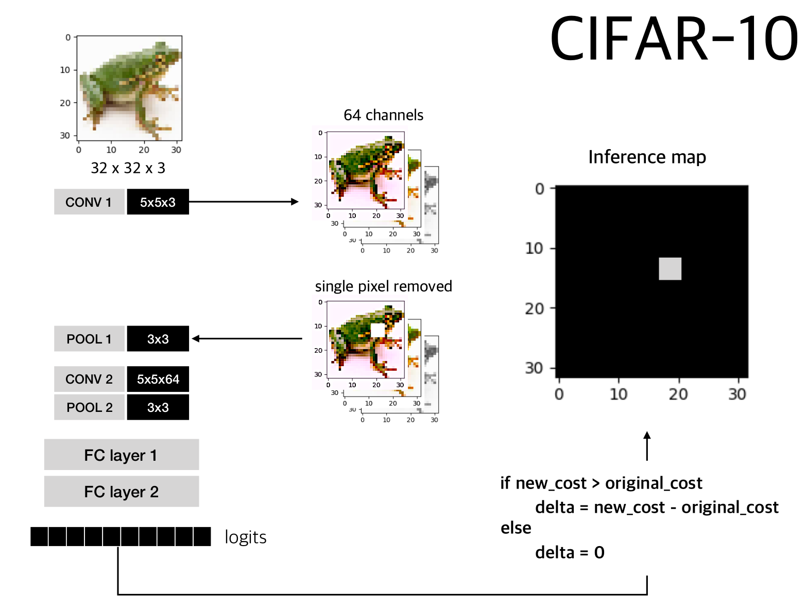
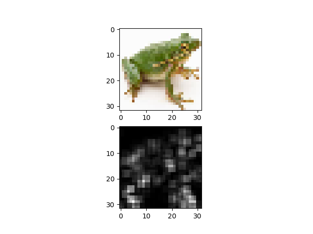

The files are originally from 
https://github.com/tensorflow/models/tree/master/tutorials/image/cifar10

20181226: modified the input size from 24x24 to 32x32

20181227: implemented single pixel deletion at first convolutional layer

modify 'cifar10_infer_final.py' 
  1. line 18: filename = "." #absolute path to input image
  2. line 41: label = [] #0~9 number corresponding to categories.

$ python cifar10_infers.py

resulting image:

